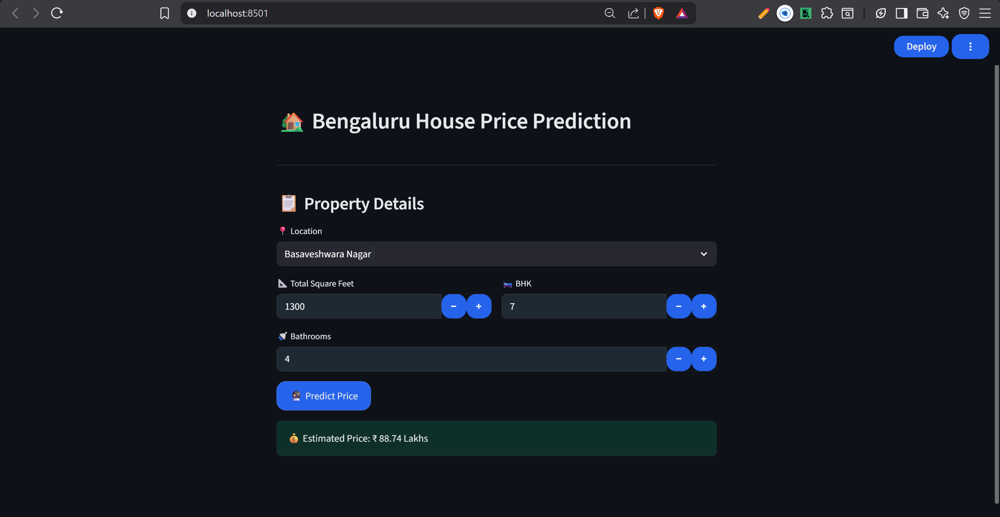

# 🏡 Bengaluru House Price Prediction – End-to-End ML Web Application

This project predicts residential house prices in Bengaluru using structured real-estate data.  
Multiple machine learning and deep learning models were explored, and the **final deployed model is XGBoost**, which achieved an **R² score of ~0.88**.  
The project also includes a **full web application** built using **FastAPI (backend)** and **Streamlit (frontend)**.

---

## 📌 Problem Overview (Brief)
House price prediction is a regression problem influenced by factors such as location, size, and amenities.  
A major challenge in this dataset is the **high-cardinality categorical feature `location`**, which requires careful preprocessing and model selection.

---




## 📊 Dataset
- **Source:** Kaggle – Bengaluru House Price Dataset  
- **Type:** Structured tabular data  
- **Target Variable:** `price`

### Features Used
- `total_sqft` – Total area of the house  
- `bath` – Number of bathrooms  
- `bhk` – Number of bedrooms  
- `location` – Area/location of the property  

---

## 🔍 Data Preprocessing
- Removed irrelevant and low-impact columns
- Handled missing values and duplicates
- Cleaned inconsistent numerical formats in `total_sqft`
- Applied feature scaling where required
- Encoded categorical variables
- Used **sklearn Pipelines** to ensure consistent preprocessing during training and inference

---

## 🧠 Models Explored

### Machine Learning Models
- Linear Regression
- Polynomial Regression
- Ridge, Lasso, ElasticNet
- K-Nearest Neighbors (KNN)
- Decision Tree
- Random Forest
- Extra Trees
- Gradient Boosting
- **XGBoost (Final Model)**
- CatBoost
- Bayesian Ridge
- Huber Regression

### Deep Learning Models
- Basic Artificial Neural Network (ANN)
- ANN with Location Embeddings

Although deep learning models performed well, **XGBoost consistently outperformed other approaches on tabular data** and was selected as the **final deployment model**.

---

## 📈 Model Evaluation
Evaluation metrics used:
- Mean Absolute Error (MAE)
- Root Mean Squared Error (RMSE)
- **R² Score**

### 🏆 Final Result
- **Best Model:** XGBoost (with full preprocessing pipeline)
- **R² Score:** **~0.88**
- **Key Insight:** Gradient-boosted tree models handled structured tabular data and encoded location features more effectively than neural networks for this dataset.

---

## 🛠 Tech Stack

### Machine Learning
- Python
- Pandas, NumPy
- Scikit-learn
- XGBoost

### Backend (API)
- FastAPI
- Uvicorn
- Joblib (model serialization)

### Frontend (UI)
- Streamlit
- Requests

---

## 🚀 Deployment Architecture

User (Browser) → Streamlit UI (Frontend) → HTTP POST → FastAPI Backend → XGBoost ML Pipeline → Predicted House Price
 

---

## ▶️ How to Run the Project Locally

### 1. Clone the Repository

```
git clone https://github.com/your-username/house-rate-prediction.git
cd house-rate-prediction
```

---

### 2. Create and Activate Virtual Environment

```
python -m venv venv
venv\Scripts\activate
```

---

### 3. Install Dependencies

```
pip install -r backend/requirements.txt
pip install streamlit requests
```
---

### 4. Run Backend (FastAPI)

```
cd backend
uvicorn app:app --reload
```

Backend URL:  
http://127.0.0.1:8000  

Swagger Docs:  
http://127.0.0.1:8000/docs  

---

### 5. Run Frontend (Streamlit)

Open a new terminal:

```
cd frontend
python -m streamlit run ui.py
```

UI URL:  
http://localhost:8501  


